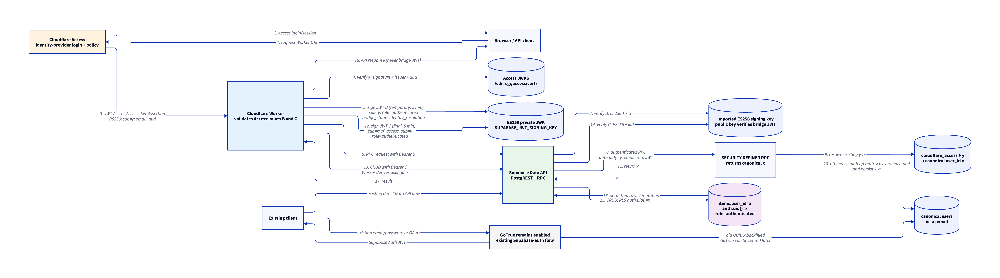

# Cloudflare Access Auth with Supabase Database

This project keeps Supabase Postgres, the Data API, and Row Level Security
(RLS), while replacing the API's GoTrue authentication path with Cloudflare
Access.

A user signs in through Cloudflare Access. The Cloudflare Worker validates that
identity, resolves it to the application's stable user UUID, and sends a
short-lived Supabase-compatible JWT to the Supabase Data API. Supabase remains
the authorization boundary: Postgres RLS decides which rows are readable or
mutable.



## What changed

The old API path was:

```text
Browser -> Supabase GoTrue -> GoTrue JWT -> Supabase Edge Function/Data API -> RLS
```

The current API path is:

```text
Browser -> Cloudflare Access -> Worker -> Supabase Data API -> Postgres RLS
```

GoTrue is not used to authenticate requests to the Worker. Supabase still owns
the application data and evaluates existing policies such as:

```sql
items.user_id = auth.uid()
```

The stable ownership UUID is called `x`. A Cloudflare Access user subject is
called `y`. They are intentionally different values:

```text
Cloudflare Access subject y -> Supabase identity mapping -> canonical user x
items.user_id = x
```

That keeps business-table ownership independent of any particular identity
provider. Existing rows do not need their `user_id` values rewritten.

## Why the Worker bridges the JWT

Cloudflare Access and Supabase do not directly trust each other's application
tokens:

- An Access application JWT is issued by Cloudflare, signed with Cloudflare's
  keys, and has an Access-specific issuer and audience.
- Supabase Data API verifies JWTs using its own configured signing keys.
- Existing Supabase RLS policies need a usable `sub` and the
  `role: "authenticated"` claim. An Access subject `y` also does not necessarily
  equal the UUID `x` already stored in `items.user_id`.

The Worker is the trust bridge. It validates the Access JWT first, then signs a
new JWT using an ES256 private key held in a Worker Secret. Supabase holds the
matching public signing key and accepts the new JWT.

## How a request is authenticated and authorized

1. Cloudflare Access authenticates the browser or CLI user and injects JWT A in
   `Cf-Access-Jwt-Assertion`.
2. The Worker validates JWT A's signature, issuer, and application audience
   using Cloudflare Access JWKS.
3. The Worker mints temporary JWT B and calls the constrained
   `resolve_or_provision_current_identity()` RPC. It resolves the Access subject
   `y` to canonical UUID `x` through Supabase identity tables.
4. JWT C reaches the Supabase Data API with `sub=x` and
   `role=authenticated`. Postgres evaluates `auth.uid()` as `x`, so the existing
   RLS ownership policy continues to apply.
5. The API client receives only the JSON result. It never receives JWT B or C.

The request path has one Cloudflare Access validation, a temporary resolver JWT,
a final CRUD JWT, and Supabase remains the only database authorization boundary.

## JWT shapes

The values below are intentionally redacted examples, not usable credentials.

```jsonc
// JWT A — issued by Cloudflare Access (RS256)
{
  "sub": "<access-sub-y>",
  "email": "user@example.com",
  "iss": "https://<team>.cloudflareaccess.com",
  "aud": ["<access-application-audience>"],
  "exp": 0
}

// JWT B — Worker-to-Supabase resolver token (ES256)
{
  "sub": "<access-sub-y>",
  "cf_access_sub": "<access-sub-y>",
  "email": "user@example.com",
  "role": "authenticated",
  "bridge_stage": "identity_resolution",
  "iat": 0,
  "exp": 0
}

// JWT C — Worker-to-Supabase CRUD token; every API request (ES256)
{
  "sub": "<canonical-user-x>",
  "cf_access_sub": "<access-sub-y>",
  "email": "user@example.com",
  "role": "authenticated",
  "iat": 0,
  "exp": 0
}
```

JWT B and JWT C have a five-minute lifetime. Their ES256 header includes the
Supabase signing-key ID (`kid`) so the Data API can select the public key used
to verify them.

## Key boundaries

- **Cloudflare Access** performs user authentication.
- **Worker** validates Access assertions, resolves the canonical identity, and
  mints the Supabase-compatible token.
- **Supabase identity tables and resolver RPC** map Access subject `y` to the
  stable application identity `x`.
- **Supabase Data API and Postgres RLS** perform data authorization.
- **Supabase GoTrue** is retained during existing-user migration, but it is not
  the authentication provider for this Worker API path.

For the detailed request/JWT sequence, see
[the PlantUML source](docs/diagrams/option-c-jwt-identity-sequence.puml) or its
[rendered diagram](docs/diagrams/option-c-jwt-identity-sequence.png).
